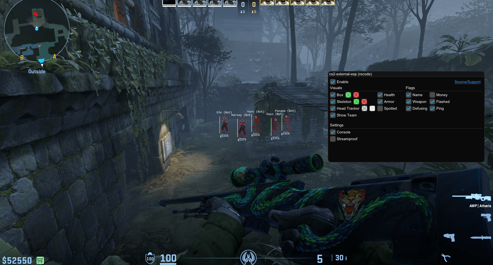

# 🕹️ CS2 External ESP (Recode)

Simple external ESP for Counter-Strike 2, after many years, the codebase has been modernized for clarity and ease of use, featuring a redesigned interface, noticeable performance improvements, and several new quality-of-life features. It also includes automatic offset scanning to help maintain compatibility through game updates.

## Showcase

> Click the picture below to go to the showcase video

[](https://youtu.be/3WHHLUyHyzA)

## 🌳 Simple Use

1. You can download it from [**Actions**](https://github.com/IMXNOOBX/cs2-external-esp/actions/workflows/auto_build.yml) tab (**You must be logged in**) or build it yourself by cloning the repository.

2. Open the game & the `cs2-external-esp.exe`, and thats it!
3. **⭐ The repository if you like the project!**

> [!IMPORTANT]
> Make sure your game is in full screen windowed❗

## 📘 Developer Instructions

1. Clone repository. Make sure you copy the command below to clone dependencies too

```sh
git clone --recursive https://github.com/IMXNOOBX/cs2-external-esp
```

	- If you cloned the repository before submodules were added, run this command
		```sh
		git submodule update --init --recursive
		```

2. Build the app using **Visual Studio 2022** (or later)
	- Build: **`x64 - Release`**

3. Locate your binary file in the folder `<arch>/<configuration>`, e.g., `x64/Release`.


## 💫 Credits

* All [contributors](https://github.com/IMXNOOBX/cs2-external-esp/graphs/contributors) who have helped improve the project!
* [a2x](https://github.com/a2x) for his [offset dumper](https://github.com/a2x/cs2-dumper) and constant updates to it!


> To the original project!
* [UnnamedZ03](https://github.com/UnnamedZ03) for providing [offsets](https://www.unknowncheats.me/forum/3846642-post734.html) and guide with his [CS2-external-base](https://github.com/UnnamedZ03/CS2-external-base)
* [ifBars](https://github.com/ifBars) for his [contributions](https://github.com/IMXNOOBX/cs2-external-esp/pull/37) to the project and ideas
* [Bekston](https://github.com/Bekston) for his [contributions](https://github.com/IMXNOOBX/cs2-external-esp/pull/20) to the project and ideas
* The _UnknownCheats_ community for their research!

# 🔖 License & Copyright

This project is licensed under [**CC BY-NC 4.0**](https://creativecommons.org/licenses/by-nc/4.0/).

```diff
+ You are free to:
	• Share: Copy and redistribute the material in any medium or format.
	• Adapt: Remix, transform, and build upon the material.
+ Under the following terms:
	• Attribution: You must give appropriate credit, provide a link to the original source repository, and indicate if changes were made.
	• Non-Commercial: You may not use the material for commercial purposes.
- You are not allowed to:
	• Sell: This license forbids selling original or modified material for commercial purposes.
	• Sublicense: This license forbids sublicensing original or modified material.
```
### ©️ Copyright
The content of this project is ©️ by [IMXNOOBX](https://github.com/IMXNOOBX) and the respective contributors. See the [LICENSE.md](LICENSE.md) file for details.
