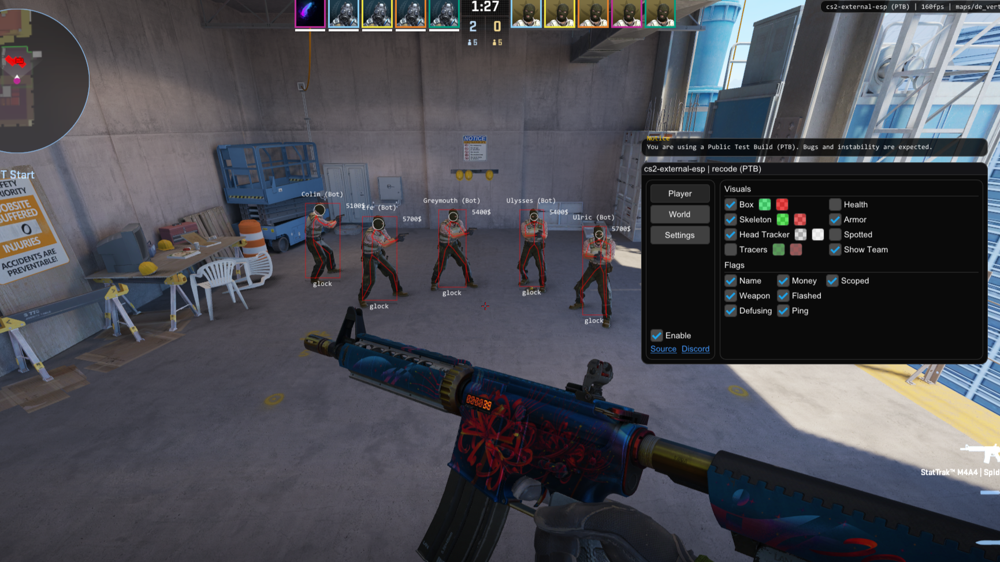

# 🕹️ CS2 External ESP | Recode

Simple external ESP for Counter-Strike 2. After years of development the codebase has been modernized for clarity and ease of use, featuring a redesigned interface, noticeable performance improvements, several quality-of-life additions, and automatic offset scanning to help maintain compatibility through game updates.

## Showcase

> Click the picture below to go to the showcase video

[](https://youtu.be/3WHHLUyHyzA)

## 🌳 Simple Use

1. You can download it from [**Releases**](./releases) tab or **build it yourself** by following [developers instructions](#-developer-instructions).

2. Open the game & the `cs2-external-esp.exe`, and thats it!
3. **⭐ The repository if you like the project!**

> [!IMPORTANT]
> Make sure your game is in full screen windowed❗

## 💡 Important

> This project is provided *'as is'* for learning purposes with no warranties or responsibility from the developers/contributors. Use it at your own risk; you are the only one accountable for your actions

* **Detection Status:** This project is intended solely for single-player use. That said, no ban reports have been raised for other modes.
* **Anti-Virus Alerts:** This software may resemble malware in behavior because it accesses other processes memory, so it is commonly flagged by anti‑virus programs. I strongly encourage you to read the source code and build it yourself by following the [developers instructions](#-developer-instructions). All provided binaries are compiled via the [GitHub workflow](.github/workflows/auto_build.yml) from the repository source.

## 🕹️ Previous Versions

> This project has been reworked **3 times**, the current one been the third!

* [Discord Overlay (2023)](./-/tree/discord-overlay) is the first and the **simplest** version of all, great to start learning.
* [Gdi Overlay (2023-2025)](./-/cs2-external-esp/tree/gdi-overlay) is an **improved version**, featuring automatic offset updating & configurations
* [Modern Version (Today)](./-/cs2-external-esp) is the current and the **latest version**, with a click ui, automatic offset scanning and more!

## 📘 Developer Instructions

1. Clone repository. Make sure you copy the command below to clone dependencies too

```sh
git clone --recursive https://gitlab.com/IMXNOOBX/cs2-external-esp
```

* If you cloned the repository before submodules were added, run this command `git submodule update --init --recursive`

2. Build the app using **Visual Studio 2022** (or later)
	- Build: **`x64 - Release`**

3. Locate your binary file in the folder `<arch>/<configuration>`, e.g., `x64/Release`.

## 💫 Credits

* All [contributors](./graphs/contributors) who have helped improve the project!
* [**a2x**](https://github.com/a2x) for his [offset dumper](https://github.com/a2x/cs2-dumper) and constant updates to it!

## 🔖 License & Copyright

This project is licensed under [**CC BY-NC 4.0**](https://creativecommons.org/licenses/by-nc/4.0/).

```diff
+ You are free to:
	• Share: Copy and redistribute the material in any medium or format.
	• Adapt: Remix, transform, and build upon the material.
+ Under the following terms:
	• Attribution: You must give appropriate credit, provide a link to the original source repository, and indicate if changes were made.
	• Non-Commercial: You may not use the material for commercial purposes.
- You are not allowed to:
	• Sell: This license forbids selling original or modified material for commercial purposes.
	• Sublicense: This license forbids sublicensing original or modified material.
```

### ©️ Copyright
The content of this project is ©️ by [IMXNOOBX](https://gitlab.com/IMXNOOBX) and the respective contributors. See the [LICENSE.md](LICENSE) file for details.
